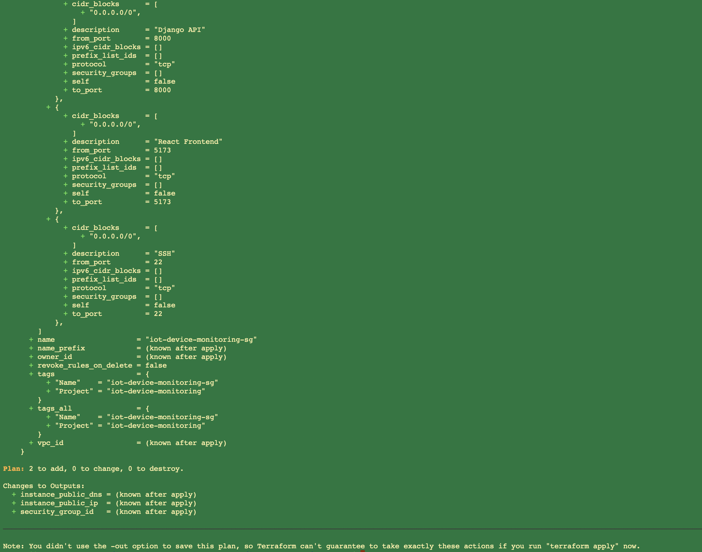

# IoT Device Monitoring Platform

<<<<<<< HEAD
A cloud-native IoT monitoring platform built with **Django REST Framework, React, Docker, Terraform, and AWS EC2**.
=======
<<<<<<< HEAD
A full-stack IoT monitoring platform built with Django REST Framework, React, Docker, and AWS EC2.
>>>>>>> a264d3a (Added infrastructure with Terraform to create and configure EC2 instance with the right specifications)

This project simulates IoT edge devices transmitting telemetry to a REST API. Incoming telemetry is processed by a Django backend, stored in a database, evaluated for alert conditions, and visualized through an interactive React dashboard. The application is fully containerized with Docker Compose, deployed on AWS EC2, and includes Terraform infrastructure definitions for reproducible cloud deployments.

---

# Project Highlights

<<<<<<< HEAD
=======
=======
A cloud-native IoT monitoring platform built with **Django REST Framework, React, Docker, Terraform, and AWS EC2**.

This project simulates IoT edge devices transmitting telemetry to a REST API. Incoming telemetry is processed by a Django backend, stored in a database, evaluated for alert conditions, and visualized through an interactive React dashboard. The application is fully containerized with Docker Compose, deployed on AWS EC2, and includes Terraform infrastructure definitions for reproducible cloud deployments.

---

# Project Highlights

>>>>>>> a264d3a (Added infrastructure with Terraform to create and configure EC2 instance with the right specifications)
- Simulated fleet of IoT edge devices
- Continuous telemetry ingestion
- Automatic alert generation
- Django REST API
- Interactive React dashboard
- Dockerized backend, frontend, and simulator
- AWS EC2 cloud deployment
- Infrastructure as Code using Terraform
- Reproducible cloud provisioning
- RESTful architecture

---

# Dashboard
<<<<<<< HEAD
=======
>>>>>>> b0a86dd (Added Terraform infrastructure and updated project documentation)
>>>>>>> a264d3a (Added infrastructure with Terraform to create and configure EC2 instance with the right specifications)


---

<<<<<<< HEAD
# Devices
=======
<<<<<<< HEAD
## Devices
=======
# Devices
>>>>>>> b0a86dd (Added Terraform infrastructure and updated project documentation)
>>>>>>> a264d3a (Added infrastructure with Terraform to create and configure EC2 instance with the right specifications)


---

<<<<<<< HEAD
# Alerts
=======
<<<<<<< HEAD
## Alerts
=======
# Alerts
>>>>>>> b0a86dd (Added Terraform infrastructure and updated project documentation)
>>>>>>> a264d3a (Added infrastructure with Terraform to create and configure EC2 instance with the right specifications)


---

<<<<<<< HEAD
# Telemetry


=======
<<<<<<< HEAD
## Telemetry


---

# Features

- Simulated IoT device fleet
- Continuous telemetry generation
- Automatic alert generation
- Django REST API
- React dashboard
- Interactive telemetry visualization
- Dockerized backend and frontend
- AWS EC2 deployment
- RESTful architecture
=======
# Telemetry


>>>>>>> b0a86dd (Added Terraform infrastructure and updated project documentation)
>>>>>>> a264d3a (Added infrastructure with Terraform to create and configure EC2 instance with the right specifications)

---

# Technology Stack

## Backend

- Django
- Django REST Framework
- SQLite

## Frontend

- React
- Vite
- Axios
- Recharts

## Infrastructure

- Docker
- Docker Compose
- AWS EC2
<<<<<<< HEAD
- Terraform
=======
<<<<<<< HEAD
=======
- Terraform
>>>>>>> b0a86dd (Added Terraform infrastructure and updated project documentation)
>>>>>>> a264d3a (Added infrastructure with Terraform to create and configure EC2 instance with the right specifications)
- Ubuntu 24.04

## Development

- Git
- GitHub

---

# System Architecture
<<<<<<< HEAD

```text
                 Simulated IoT Devices
                          │
                          ▼
                 Django REST API
                          │
                 Alert Processing
                          │
                    SQLite Database
                          │
                          ▼
                 React Dashboard
                          │
                    Docker Compose
                          │
                    AWS EC2 (Ubuntu)

<<<<<<< HEAD
          Infrastructure Provisioned by Terraform
=======
                     Docker Compose

      ┌─────────────────────────────────────┐
      │                                     │
      │         React Frontend              │
      │               │                     │
      │          REST API                   │
      │               │                     │
      │        Django Backend               │
      │               │                     │
      │          SQLite Database            │
      │                                     │
      └─────────────────────────────────────┘
                    ▲
                    │
             Device Simulator
=======

```text
                 Simulated IoT Devices
                          │
                          ▼
                 Django REST API
                          │
                 Alert Processing
                          │
                    SQLite Database
                          │
                          ▼
                 React Dashboard
                          │
                    Docker Compose
                          │
                    AWS EC2 (Ubuntu)

          Infrastructure Provisioned by Terraform
>>>>>>> b0a86dd (Added Terraform infrastructure and updated project documentation)
>>>>>>> a264d3a (Added infrastructure with Terraform to create and configure EC2 instance with the right specifications)
```

---

# Project Structure

<<<<<<< HEAD
```text
iot-device-monitoring-platform/

=======
<<<<<<< HEAD
```
iot-device-monitoring-platform/

backend/
frontend/
simulator/

docker-compose.yml

README.md
=======
```text
iot-device-monitoring-platform/

>>>>>>> a264d3a (Added infrastructure with Terraform to create and configure EC2 instance with the right specifications)
├── backend/
├── frontend/
├── simulator/
├── infrastructure/
│   └── terraform/
├── screenshots/
├── docker-compose.yml
├── README.md
└── .gitignore
<<<<<<< HEAD
=======
>>>>>>> b0a86dd (Added Terraform infrastructure and updated project documentation)
>>>>>>> a264d3a (Added infrastructure with Terraform to create and configure EC2 instance with the right specifications)
```

---

# REST API

| Endpoint | Description |
|----------|-------------|
<<<<<<< HEAD
=======
<<<<<<< HEAD
| `/api/devices/` | List all devices |
| `/api/telemetry/` | Device telemetry |
| `/api/alerts/` | Generated alerts |
=======
>>>>>>> a264d3a (Added infrastructure with Terraform to create and configure EC2 instance with the right specifications)
| `/api/devices/` | List all registered devices |
| `/api/telemetry/` | Retrieve telemetry readings |
| `/api/alerts/` | Retrieve generated alerts |
| `/api/telemetry/ingest/` | Receive simulated telemetry |
<<<<<<< HEAD
=======
>>>>>>> b0a86dd (Added Terraform infrastructure and updated project documentation)
>>>>>>> a264d3a (Added infrastructure with Terraform to create and configure EC2 instance with the right specifications)

---

# Running Locally

Clone the repository

```bash
git clone https://github.com/nanakwamekankam/iot-device-monitoring-platform.git

cd iot-device-monitoring-platform
```

Build and start all services
<<<<<<< HEAD

```bash
docker compose up --build
```

Access the application

Frontend

```
http://localhost:5173
```

Backend API

```
http://localhost:8000/api/
```

Stop services

```bash
docker compose down
```

---

# Deploying to AWS EC2

Clone the repository

```bash
git clone https://github.com/nanakwamekankam/iot-device-monitoring-platform.git

cd iot-device-monitoring-platform
```

Build and start

```bash
<<<<<<< HEAD
=======
docker run --rm -p 8000:8000 iot-backend
```

Run migrations
=======

```bash
docker compose up --build
```

Access the application

Frontend

```
http://localhost:5173
```

Backend API
>>>>>>> b0a86dd (Added Terraform infrastructure and updated project documentation)

```
http://localhost:8000/api/
```

<<<<<<< HEAD
---

# Deployment

Pull latest changes

```bash
git pull
```

Rebuild
=======
Stop services
>>>>>>> b0a86dd (Added Terraform infrastructure and updated project documentation)

```bash
docker compose down

<<<<<<< HEAD
=======
---

# Deploying to AWS EC2

Clone the repository

```bash
git clone https://github.com/nanakwamekankam/iot-device-monitoring-platform.git

cd iot-device-monitoring-platform
```

Build and start

```bash
>>>>>>> b0a86dd (Added Terraform infrastructure and updated project documentation)
>>>>>>> a264d3a (Added infrastructure with Terraform to create and configure EC2 instance with the right specifications)
docker compose up -d --build
```

Verify

```bash
docker compose ps
```

---

<<<<<<< HEAD
# Terraform Infrastructure

Terraform files are located in:

```text
infrastructure/terraform/
```

Validate configuration

```bash
terraform fmt

terraform init

terraform validate
```

Preview infrastructure changes

```bash
terraform plan
```



Provision infrastructure

```bash
terraform apply
```

Destroy infrastructure

```bash
terraform destroy
```

> **Note:** Terraform provisions a new EC2 instance and security group. It does not manage the manually created EC2 instance used during development.

---

=======
<<<<<<< HEAD
>>>>>>> a264d3a (Added infrastructure with Terraform to create and configure EC2 instance with the right specifications)
# Skills Demonstrated

- Full-stack software engineering
- REST API development
- React frontend development
- Infrastructure as Code (Terraform)
- Docker containerization
- Cloud deployment on AWS EC2
- Cloud networking (Security Groups)
- Linux server administration
- Git-based deployment workflow
- Client-server architecture
=======
# Terraform Infrastructure

Terraform files are located in:

```text
infrastructure/terraform/
```

Validate configuration

```bash
terraform fmt

terraform init

terraform validate
```

Preview infrastructure changes

```bash
terraform plan
```

Provision infrastructure

```bash
terraform apply
```

Destroy infrastructure

```bash
terraform destroy
```

> **Note:** Terraform provisions a new EC2 instance and security group. It does not manage the manually created EC2 instance used during development.

---

# Skills Demonstrated

- Full-stack software engineering
- REST API development
- React frontend development
- Infrastructure as Code (Terraform)
- Docker containerization
- Cloud deployment on AWS EC2
- Cloud networking (Security Groups)
- Linux server administration
- Git-based deployment workflow
- Client-server architecture
>>>>>>> b0a86dd (Added Terraform infrastructure and updated project documentation)
