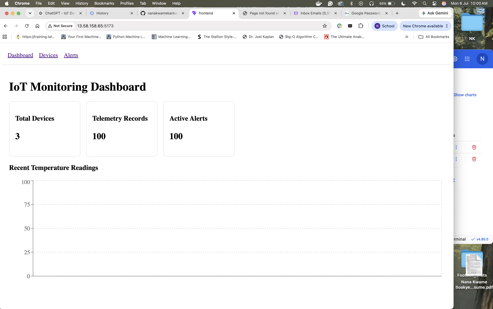
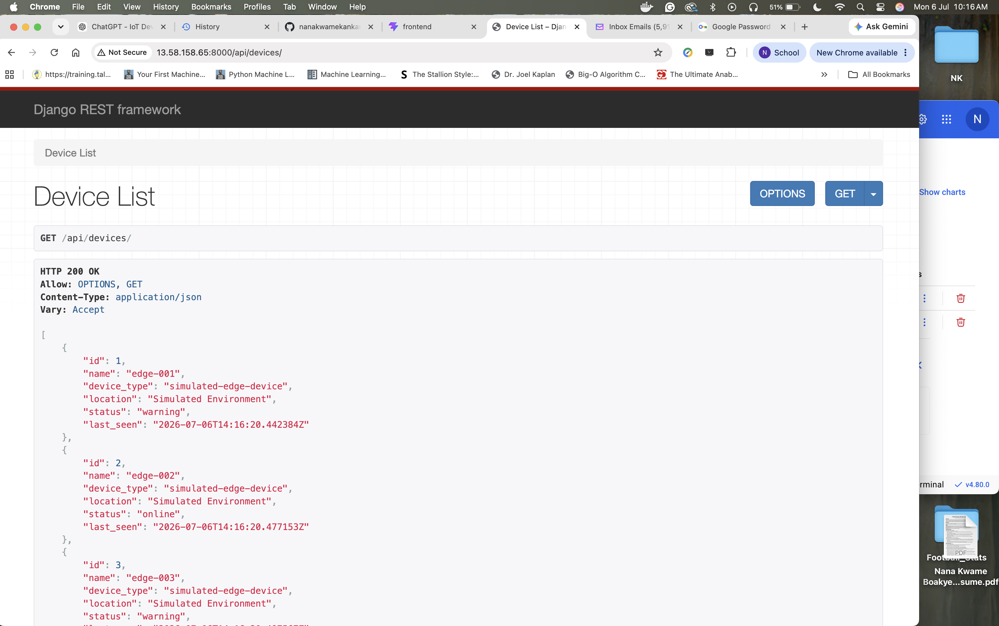
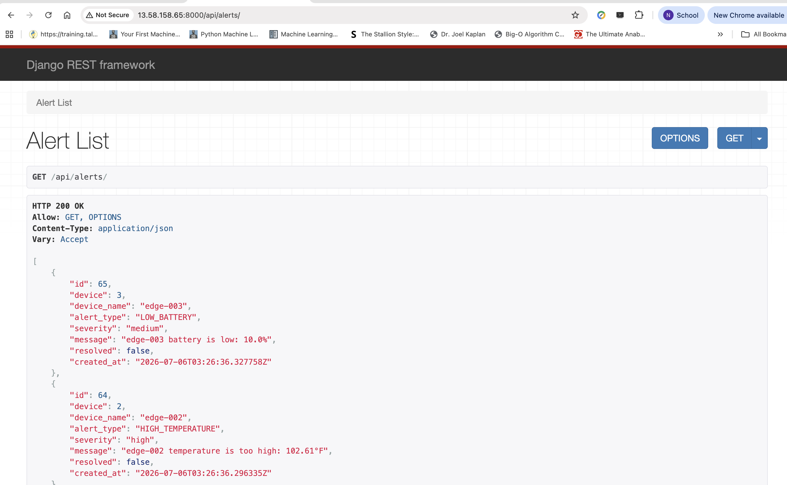
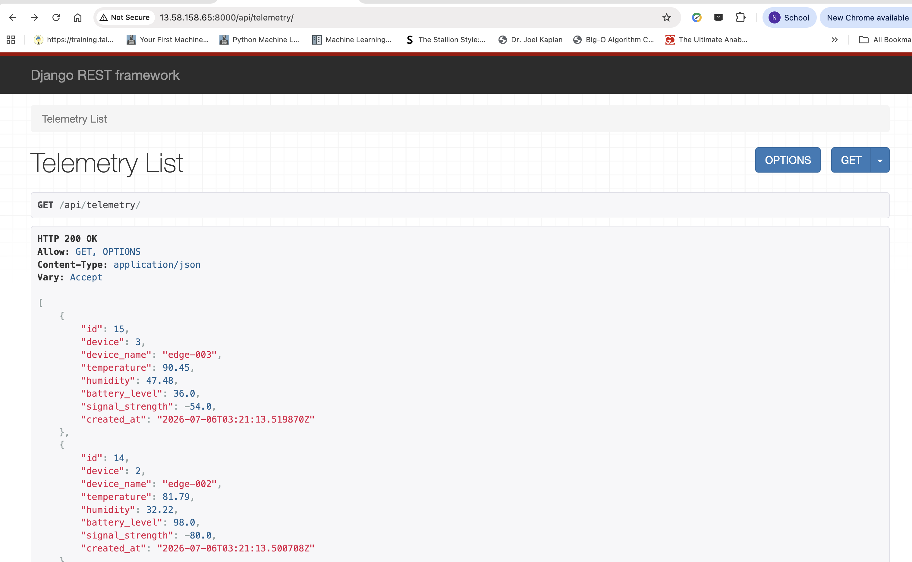

# IoT Device Monitoring Platform

A full-stack IoT monitoring platform built with Django REST Framework, React, Docker, and AWS EC2.

This project simulates IoT edge devices transmitting telemetry to a REST API. Incoming telemetry is stored, monitored for threshold violations, and displayed in a real-time React dashboard. The entire application is containerized with Docker Compose and deployed on an AWS EC2 instance.

---

## Dashboard




---

## Devices



---

## Alerts



---

## Telemetry



---

# Features

- Simulated IoT device fleet
- Continuous telemetry generation
- Automatic alert generation
- Django REST API
- React dashboard
- Interactive telemetry visualization
- Dockerized backend and frontend
- AWS EC2 deployment
- RESTful architecture

---

# Technology Stack

## Backend

- Django
- Django REST Framework
- SQLite

## Frontend

- React
- Vite
- Axios
- Recharts

## Infrastructure

- Docker
- Docker Compose
- AWS EC2
- Ubuntu 24.04

## Development

- Git
- GitHub

---

# System Architecture

```
                 AWS EC2 (Ubuntu)

                     Docker Compose

      ┌─────────────────────────────────────┐
      │                                     │
      │         React Frontend              │
      │               │                     │
      │          REST API                   │
      │               │                     │
      │        Django Backend               │
      │               │                     │
      │          SQLite Database            │
      │                                     │
      └─────────────────────────────────────┘
                    ▲
                    │
             Device Simulator
```

---

# Project Structure

```
iot-device-monitoring-platform/

backend/
frontend/
simulator/

docker-compose.yml

README.md
```

---

# REST API

| Endpoint | Description |
|----------|-------------|
| `/api/devices/` | List all devices |
| `/api/telemetry/` | Device telemetry |
| `/api/alerts/` | Generated alerts |

---

# Running Locally

Clone the repository

```bash
git clone https://github.com/nanakwamekankam/iot-device-monitoring-platform.git
cd iot-device-monitoring-platform
```

Build and start all services

```bash
docker compose up -d --build
```

Stop all services

```bash
docker compose down
```

---

# Backend Only

Build

```bash
docker build -t iot-backend ./backend
```

Run

```bash
docker run --rm -p 8000:8000 iot-backend
```

Run migrations

```bash
docker run --rm iot-backend python manage.py migrate
```

---

# Deployment

Pull latest changes

```bash
git pull
```

Rebuild

```bash
docker compose down

docker compose up -d --build
```

Verify

```bash
docker compose ps
```

---

# Skills Demonstrated

- Full-stack application development
- REST API design
- React frontend development
- Docker containerization
- Cloud deployment on AWS EC2
- Git-based deployment workflow
- Client-server architecture