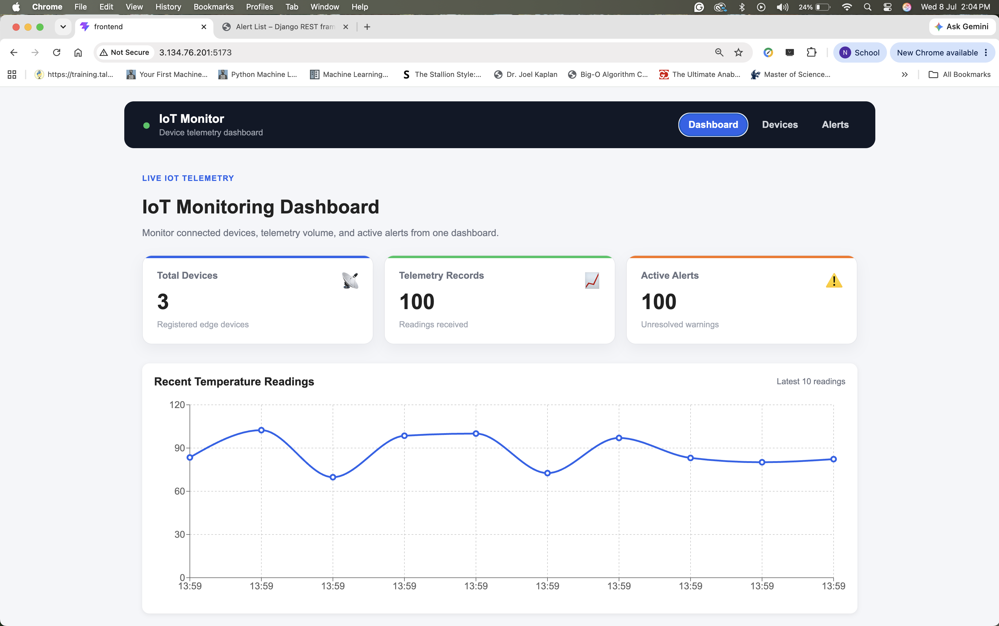
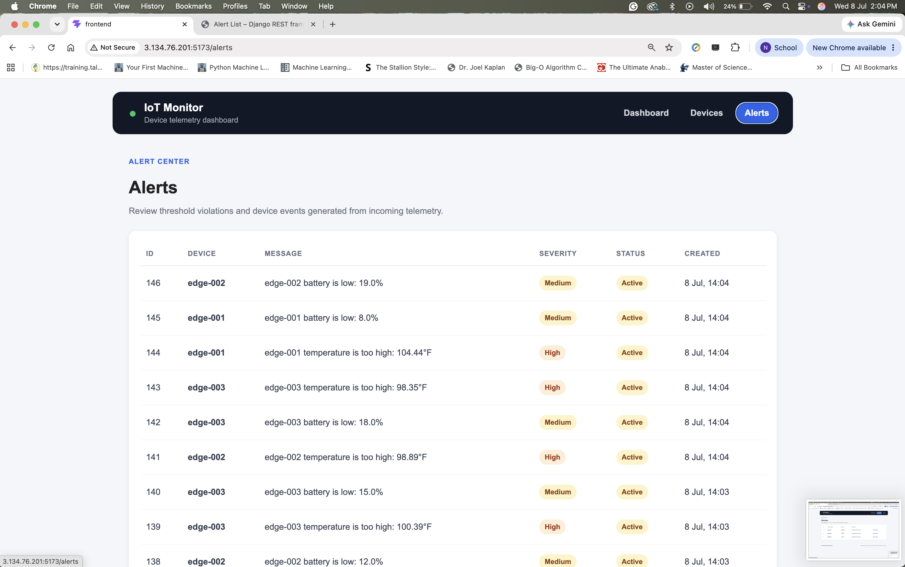
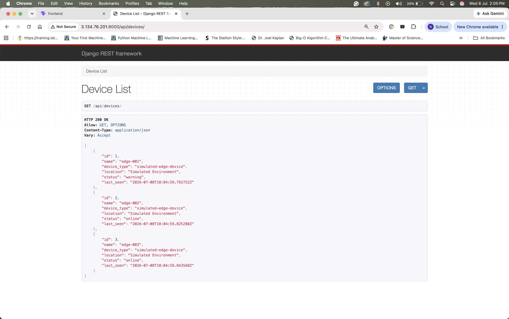
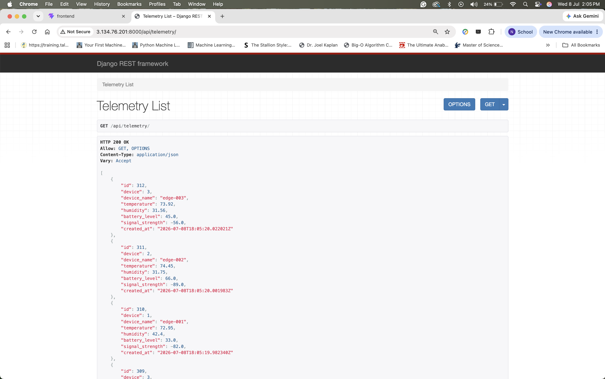
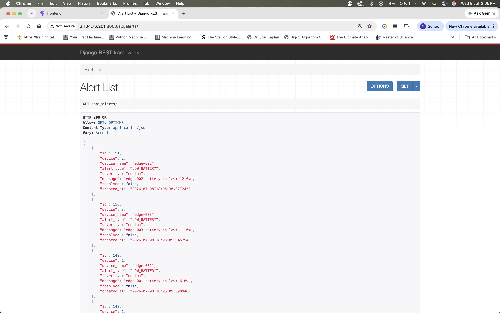

# IoT Device Monitoring Platform

A cloud-native IoT monitoring platform built with **Django REST Framework**, **React**, **Docker**, **Terraform**, and **AWS EC2**.

This project simulates a fleet of IoT edge devices transmitting telemetry to a REST API. Incoming telemetry is stored in a database, monitored for threshold violations, and displayed through a responsive React dashboard. The application is containerized with Docker Compose, deployed on AWS EC2, and the cloud infrastructure can be recreated using Terraform.

## Key Highlights

- Built a full-stack IoT monitoring platform using Django and React
- Simulated real-time telemetry from edge devices
- Containerized the application with Docker Compose
- Deployed the application on AWS EC2
- Provisioned cloud infrastructure using Terraform
- Implemented RESTful APIs and interactive data visualizations

---
# Frontend Pages

## Dashboard
Dashboard shows telemetry readings with time stamps



## Devices
The list of devices


##  Alerts
Alerts for when device telemetry readings reach or surpass thresholds



---

# Backend Databases

## Devices
Database of Devices being monitored


##  Telemetry
Backend Telemetry Logs when simulator is running


##  Alerts
Alerts Database when telemetry reaches or passes threshold


---


# Features

- Simulated fleet of IoT devices
- Automatic telemetry generation
- Threshold-based alert generation
- Django REST API serving telemetry, device, and alert data.
- React dashboard (automatically refreshes every 5 seconds to display the latest device status, telemetry, and alerts.)
- Interactive telemetry visualization
- Dockerized backend and frontend deployment on AWS EC2 with Terraform-managed infrastructure.
- Infrastructure as Code using Terraform
- AWS EC2 deployment
- RESTful architecture

---

# Technology Stack

## Backend

- Django
- Django REST Framework
- SQLite

## Frontend

- React
- Vite
- Axios
- Recharts

## Infrastructure

- AWS EC2
- Ubuntu 24.04
- Docker
- Docker Compose
- Terraform

## Development

- Git
- GitHub

---

# System Architecture

```text
                    Simulated IoT Devices
                             │
                             │
                      HTTP REST Requests
                             │
                             ▼
                 ┌─────────────────────────┐
                 │     Django REST API     │
                 └──────────┬──────────────┘
                            │
                     Store Telemetry
                            │
                            ▼
                     SQLite Database
                            │
                     REST Endpoints
                            │
                            ▼
                  React Dashboard (Vite)
                            │
                     Interactive Charts
                            │
                            ▼
                    End User Browser


Entire application deployed on:

AWS EC2
    │
Ubuntu 24.04
    │
Docker Compose
```

---

# Project Structure

```text
iot-device-monitoring-platform/

├── backend/
│   ├── devices/
│   ├── monitoring/
│   ├── Dockerfile
│   └── manage.py
│
├── frontend/
│   ├── src/
│   ├── public/
│   └── Dockerfile
│
├── simulator/
│   └── device_simulator.py
│
├── infrastructure/
│   └── terraform/
│       ├── main.tf
│       ├── variables.tf
│       ├── outputs.tf
│       └── README.md
│
├── screenshots/
│
├── docker-compose.yml
├── README.md
└── .gitignore
```

---

# REST API

| Endpoint | Description |
|-----------|-------------|
| `/api/devices/` | List all simulated devices |
| `/api/telemetry/` | Retrieve telemetry readings |
| `/api/alerts/` | Retrieve generated alerts |

---

# Running Locally

Clone the repository

```bash
git clone https://github.com/nanakwamekankam/iot-device-monitoring-platform.git

cd iot-device-monitoring-platform
```

Start all services

```bash
docker compose up -d --build
```

Verify containers

```bash
docker compose ps
```

Stop the application

```bash
docker compose down
```

---

# Running the Device Simulator

Start the backend first, then run

```bash
python simulator/device_simulator.py
```

The simulator continuously generates random telemetry and automatically creates alerts whenever configured thresholds are exceeded.

---

# Deployment

Update the server

```bash
git pull
```

Rebuild containers

```bash
docker compose down

docker compose up -d --build
```

Verify

```bash
docker compose ps
```

---

# Terraform Infrastructure

The project includes Terraform configuration capable of provisioning AWS infrastructure.

Resources include:

- EC2 instance
- Security Group
- SSH access
- Django API port (8000)
- React frontend port (5173)
- Terraform outputs for public IP and DNS

Initialize Terraform

```bash
cd infrastructure/terraform

terraform init
```

Validate configuration

```bash
terraform validate
```

Preview infrastructure

```bash
terraform plan
```


To provision infrastructure

```bash
terraform apply
```

---

# Skills Demonstrated

- Full-stack application development
- Django REST API development
- React frontend development
- Docker containerization
- Infrastructure as Code (Terraform)
- Cloud deployment on AWS EC2
- Linux server administration
- Git and GitHub workflow
- RESTful architecture
- IoT telemetry simulation
- Client-server architecture

---

# Future Improvements

- PostgreSQL instead of SQLite
- MQTT message broker
- AWS RDS backend
- AWS Application Load Balancer
- HTTPS with Nginx
- GitHub Actions CI/CD
- CloudWatch monitoring
- Authentication and user management
- Device registration workflow
- Historical analytics dashboard